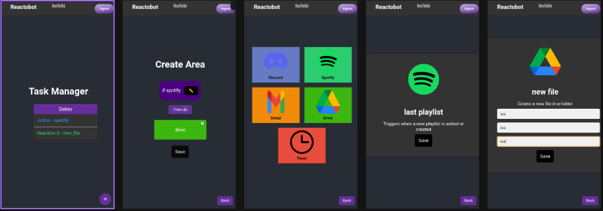
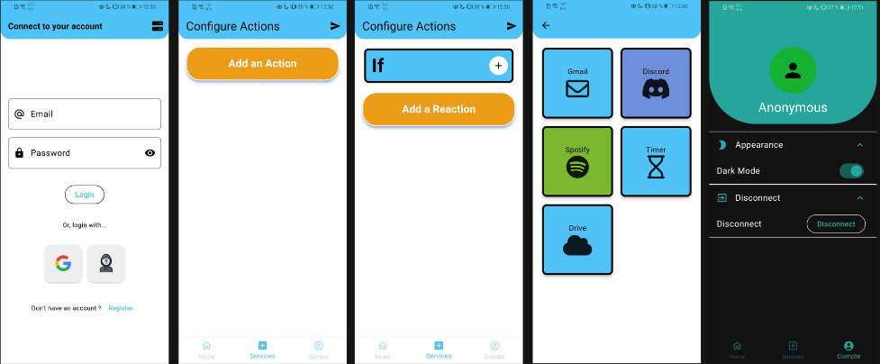

# Action REAction - Automation Platform for Digital Life

## Project Overview

**Language:** React (JS), Flutter, Node.js

**Summary:**
Action REAction (AREA) is an automation platform designed to facilitate interactions between various digital services, similar to platforms like IFTTT or Zapier.

## Key Components

1. **Application Server:**
   - Core business logic orchestrating the interaction of various digital services.

2. **Web Client:**
   - Browser-based interface for user interaction with the application server.

3. **Mobile Client:**
   - Similar to the web client, designed for mobile platforms.

## Functionality

- User Registration and Authentication
- Configuration of Actions and REActions (event-based triggers)
- Synchronization between web and mobile clients

## Technical Aspects

- Docker Compose for project construction
- Detailed API documentation
- Incremental development: from a proof of concept to a minimum viable product, and finally to a fully-featured product

## Contents

- [Prerequisites](#prerequisites)
- [Documentation](#documentation)
- [Installation](#installation)
- [Usage](#usage)
- [Commit Standard](#commit-standard)
- [Credits](#credits)
- [Images](#images)

## Prerequisites

- Docker

## Documentation

Tutorial and documentation to implement new functions and services are available [here](https://github.com/Astramat/Area/tree/main/doc/).

## Installation

Follow the tutorial [here](https://github.com/Astramat/Area/tree/main/doc/) for easy installation.

## Usage

- [Frontend Web](https://github.com/Astramat/Area/tree/main/doc/FRONT-WEB/frontweb.md)
- [Frontend Mobile](https://github.com/Astramat/Area/tree/main/doc/FRONT-MOBILE/frontmobile.md)
- [Backend](https://github.com/Astramat/Area/tree/main/doc/BACK-END/backend.md)

## Commit Standard

By adhering to these standards, we aim to keep our codebase organized and our development process streamlined. We believe that a well-maintained commit history is a reflection of the team's dedication and professionalism. [Commit Standard](https://www.conventionalcommits.org/en/v1.0.0/)

## Credits

- **Louis DE-CAUMONT**
- **Antoine DUFOUR**
- **Matthis BROCHETON**
- **Guillaume LE COZ**
- **Victor M. SMITH**

## Images

